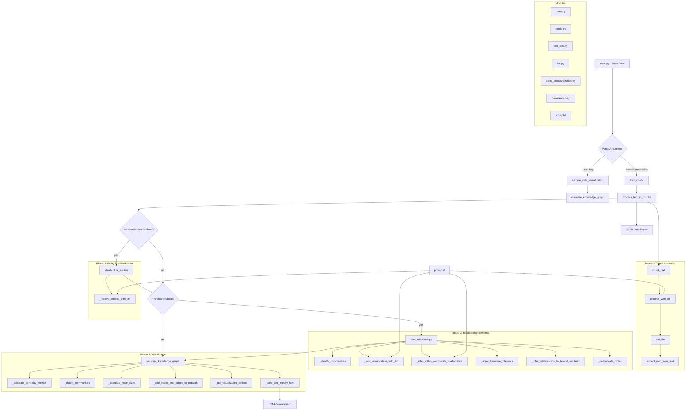

# AI Powered Knowledge Graph Generator

This system takes an unstructured text document, and uses an LLM of your choice to extract knowledge in the form of Subject-Predicate-Object (SPO) triplets, and visualizes the relationships as an interactive knowledge graph.
A demo of a knowlege graph created with this project can be found here: [Industrial-Revolution Knowledge Graph](https://robert-mcdermott.github.io/ai-knowledge-graph/)


## Features

- **Text Chunking**: Automatically splits large documents into manageable chunks for processing
- **Knowledge Extraction**: Uses AI to identify entities and their relationships
- **Entity Standardization**: Ensures consistent entity naming across document chunks
- **Relationship Inference**: Discovers additional relationships between disconnected parts of the graph
- **Interactive Visualization**: Creates an interactive graph visualization
- **Works with Any OpenAI Compatible API Endpoint**: Ollama, LM Studio, OpenAI, vLLM, LiteLLM (provides access to AWS Bedrock, Azure OpenAI, Anthropic and many other LLM services) 

## Requirements

- Python 3.11+
- Dependencies: `networkx`, `jinja2`, `requests` (installed by `pip install -e .` or `uv sync`)

## Quick Start

1. Clone this repository
2. Install: `pip install -e .` (or `uv sync`)
3. Configure your settings in `config.toml`
4. Run the system:

```bash
generate-graph --input your_text_file.txt --output knowledge_graph.html
```

Or with UV:

```bash
uv run generate-graph --input your_text_file.txt --output knowledge_graph.html
```

Or straight from the checkout without installing:

```bash
python generate-graph.py --input your_text_file.txt --output knowledge_graph.html
```

### Development

```bash
pip install -e ".[dev]"   # adds pytest and ruff
pytest -q                 # 86 tests, no LLM needed
ruff check .
```

## Configuration

The system can be configured using the `config.toml` file:

```toml
[llm]
model = "gemma3"  # Google open weight model
api_key = "sk-1234"              # or "env:OPENAI_API_KEY" to read it from the environment
base_url = "http://localhost:11434/v1/chat/completions" # Local Ollama instance running locally (but can be any OpenAI compatible endpoint)
max_tokens = 32768               # reasoning models need a large budget, see note below
temperature = 0.2                # omit for models that only accept the default (e.g. gpt-5)
# Optional:
#timeout = 300                   # seconds per request
#max_retries = 3                 # retries on 429/5xx/connection errors
#token_param = "auto"            # auto-switches to max_completion_tokens for newer OpenAI models
#json_mode = false               # request response_format = json_object
#concurrency = 4                 # chunks extracted in parallel
#reasoning_effort = "low"        # passed through to servers/models that support it
#[llm.extra_body]                # arbitrary extra request fields, e.g. Ollama's think switch
#think = false

[chunking]
chunk_size = 200  # Number of words per chunk
overlap = 20      # Number of words to overlap between chunks

[standardization]
enabled = true               # Enable entity standardization
use_llm_for_entities = true  # Use LLM for additional entity resolution
#merge_word_subsets = false  # Aggressive heuristic merging by shared words (off by default)

[inference]
enabled = true               # Enable relationship inference
use_llm_for_inference = true # Master switch for LLM inference (bridging, hub enrichment, within-component)
#llm_bridge = true           # LLM links every isolated component to the main graph
#llm_hub = true              # LLM adds well-known relationships among the most central entities
#taxonomy = true             # Rule: "quantum computing" is a "computing" (deterministic, on by default)
apply_transitive = false     # Rule-based A->B->C => A->C for transitive predicates (off by default)
#lexical = false             # Rule-based "related to" edges for names sharing a word (off by default)
#max_inferred_ratio = 0.5    # Cap inferred edges at this fraction of extracted edges
```

Every inferred triple in the JSON output carries `"inferred": true` and a `"method"`
(`llm_bridge`, `llm_hub`, `llm_within`, `taxonomy`, `transitive` or `lexical`); transitive triples
also record the intermediate node in `"via"`. Rule-based inference is off by default because in testing it
generated roughly 70 % of all edges and hid the relationships actually found in the text.

### A note on reasoning models

Models such as DeepSeek, Qwen3, gpt-5 and the o-series "think" before they answer, and that
hidden reasoning is charged against `max_tokens`. With a small budget the model can spend
everything on reasoning and return **no answer at all**. The generator detects this
(`finish_reason = "length"`) and aborts with an explanation instead of silently producing an
empty graph. Set `max_tokens` to 16k–32k for such models, lower `reasoning_effort`, use
smaller chunks, or pass `--continue-on-error` to skip failed chunks and accept an
incomplete graph.

## Command Line Options

- `--input FILE`: Input text file to process
- `--output FILE`: Output HTML file for visualization (default: knowledge_graph.html)
- `--config FILE`: Path to config file (default: config.toml)
- `--debug`: Enable debug output with raw LLM responses
- `--no-standardize`: Disable entity standardization
- `--no-inference`: Disable relationship inference
- `--continue-on-error`: Skip chunks whose LLM call fails or is truncated instead of aborting
- `--from-json FILE`: Re-render the visualization from a previously saved `.json` triples file (no LLM calls)
- `--test`: Generate sample visualization using test data

### Usage message (--help)

```bash
generate-graph --help
usage: generate-graph [-h] [--test] [--config CONFIG] [--output OUTPUT] [--input INPUT] [--debug] [--no-standardize] [--no-inference] [--continue-on-error]

Knowledge Graph Generator and Visualizer

options:
  -h, --help        show this help message and exit
  --test            Generate a test visualization with sample data
  --config CONFIG   Path to configuration file
  --output OUTPUT   Output HTML file path
  --input INPUT     Path to input text file (required unless --test is used)
  --debug           Enable debug output (raw LLM responses and extracted JSON)
  --no-standardize  Disable entity standardization
  --no-inference    Disable relationship inference
  --continue-on-error
                    Skip chunks whose LLM call fails or is truncated instead of aborting
```

### Example Run

**Command:**

```bash
generate-graph --input data/industrial-revolution.txt --output industrial-revolution-kg.html
```
**Console Output:**

```markdown
Using input text from file: data/industrial-revolution.txt
==================================================
PHASE 1: INITIAL TRIPLE EXTRACTION
==================================================
Processing text in 13 chunks (size: 100 words, overlap: 20 words)
Processing chunk 1/13 (100 words)
Processing chunk 2/13 (100 words)
Processing chunk 3/13 (100 words)
Processing chunk 4/13 (100 words)
Processing chunk 5/13 (100 words)
Processing chunk 6/13 (100 words)
Processing chunk 7/13 (100 words)
Processing chunk 8/13 (100 words)
Processing chunk 9/13 (100 words)
Processing chunk 10/13 (100 words)
Processing chunk 11/13 (100 words)
Processing chunk 12/13 (86 words)
Processing chunk 13/13 (20 words)

Extracted a total of 216 triples from all chunks

==================================================
PHASE 2: ENTITY STANDARDIZATION
==================================================
Starting with 216 triples and 201 unique entities
Standardizing entity names across all triples...
Applied LLM-based entity standardization for 15 entity groups
Standardized 201 entities into 181 standard forms
After standardization: 216 triples and 160 unique entities

==================================================
PHASE 3: RELATIONSHIP INFERENCE
==================================================
Starting with 216 triples
Top 5 relationship types before inference:
  - enables: 20 occurrences
  - impacts: 15 occurrences
  - enabled: 12 occurrences
  - pioneered: 10 occurrences
  - invented: 9 occurrences
Inferring additional relationships between entities...
Identified 9 disconnected communities in the graph
Inferred 3 new relationships between communities
Inferred 3 new relationships between communities
Inferred 3 new relationships between communities
Inferred 3 new relationships between communities
Inferred 3 new relationships between communities
Inferred 3 new relationships between communities
Inferred 3 new relationships between communities
Inferred 3 new relationships between communities
Inferred 3 new relationships between communities
Inferred 3 new relationships between communities
Inferred 9 new relationships within communities
Inferred 2 new relationships within communities
Inferred 88 relationships based on lexical similarity
Added -22 inferred relationships

Top 5 relationship types after inference:
  - related to: 65 occurrences
  - advances via Artificial Intelligence: 36 occurrences
  - pioneered via computing: 26 occurrences
  - enables via computing: 24 occurrences
  - enables: 21 occurrences

Added 370 inferred relationships
Final knowledge graph: 564 triples
Saved raw knowledge graph data to /mnt/c/Users/rmcdermo/Documents/industrial-revolution-kg.json
Processing 564 triples for visualization
Found 161 unique nodes
Found 355 inferred relationships
Detected 9 communities using Louvain method
Nodes in NetworkX graph: 161
Edges in NetworkX graph: 537
Knowledge graph visualization saved to /mnt/c/Users/rmcdermo/Documents/industrial-revolution-kg.html
Graph Statistics: {
  "nodes": 161,
  "edges": 564,
  "original_edges": 209,
  "inferred_edges": 355,
  "communities": 9
}

Knowledge Graph Statistics:
Nodes: 161
Edges: 564
Communities: 9

To view the visualization, open the following file in your browser:
file:///mnt/c/Users/rmcdermo/Documents/industrial-revolution-kg.html
```

## How It Works

1. **Chunking**: The document is split into overlapping chunks on sentence boundaries to fit within the LLM's context window
2. **First Pass - SPO Extraction**: 
   - Chunks are processed by the LLM in parallel (`llm.concurrency`) to extract typed Subject-Predicate-Object triplets, each tagged with the sentence it came from
   - Implemented in the `process_with_llm` function
   - The LLM identifies entities and their relationships within each text segment
   - Results are collected across all chunks to form the initial knowledge graph
3. **Second Pass - Entity Standardization**:
   - Basic standardization through text normalization
   - Optional LLM-assisted entity alignment (controlled by `standardization.use_llm_for_entities` config)
   - When enabled, the LLM reviews all unique entities from the graph and identifies groups that refer to the same concept
   - This resolves cases where the same entity appears differently across chunks (e.g., "AI", "artificial intelligence", "AI system")
   - Standardization helps create a more coherent and navigable knowledge graph
4. **Third Pass - Relationship Inference**:
   - Automatic inference of transitive relationships
   - LLM-assisted inference (controlled by `inference.use_llm_for_inference`): a *bridging* pass links
     every isolated component to the main graph, a *hub enrichment* pass adds well-known relationships
     between the most central entities (e.g. "internet enabled e-commerce"), and a *within-component*
     pass connects lexically related pairs
   - A deterministic *taxonomy* rule links specific terms to their general term ("quantum computing" is a "computing")
   - This reduces graph fragmentation by adding logical connections not explicitly stated in the text
   - Both rule-based and LLM-based inference methods work together to create a more comprehensive graph
5. **Visualization**: An interactive HTML visualization is generated from the project's own template with the embedded vis-network library

Both the second and third passes are optional and can be disabled in the configuration to minimize LLM usage or control these processes manually.

## Visualization Features

The generated HTML is a single self-contained file (vis-network is embedded) that works offline.

- **Explore by clicking**: click a node to highlight its neighbourhood and open a details panel listing every
  incoming and outgoing relationship, tagged *extracted* or with its inference method; click a row to jump to
  that node. Double-click to zoom in.
- **Entity types**: the extraction pass labels every entity (person, organization, place, event, technology,
  product, work, date, concept); node shapes reflect the type and the Communities panel can filter by it.
- **Provenance**: each extracted relationship carries the sentence it came from, shown in tooltips and in
  the details panel, so inferred edges are easy to tell apart from what the text actually says.
- **Named communities**: after community detection the LLM gives each community a short name (one call;
  disable with `visualization.name_communities = false`).
- **Search** with autocomplete (`/`), and shareable links: the selected node is kept in the URL (`#node=...`).
- **Communities panel**: colour-coded Louvain communities with their top entities, toggle any of them on/off,
  a minimum-connections slider, and a switch for inferred relationships.
- **Edge labels on selection** by default (so dense graphs stay readable); cycle to *all* or *none*.
- **Node size** reflects importance (degree, betweenness and eigenvector centrality).
- **Extracted vs inferred**: solid lines are extracted from the text, dashed lines are inferred; tooltips show
  the inference method and, for transitive edges, the intermediate node.
- **Export** the current view as PNG, or the visible triples as JSON or CSV.
- **Physics controls**, a layout progress bar, automatic physics freeze for graphs over 300 nodes, light and
  dark themes (remembered per browser), keyboard shortcuts (`?` for the list), responsive layout.

## Project Layout

```
.
├── config.toml                     # Main configuration file for the system
├── generate-graph.py               # Run from a checkout without installing
├── json_to_html.py                 # Re-render a saved .json graph (same as --from-json)
├── pyproject.toml                  # Project metadata, dependencies, tool config
├── requirements.txt                # Pinned dependencies for 'pip' users
├── uv.lock                         # Lock file for 'uv' users
├── tests/                          # pytest suite (runs without an LLM)
└── src/knowledge_graph/            # Core package (installed as `knowledge_graph`)
    ├── __init__.py                 # Package initialization and version
    ├── config.py                   # Configuration loading, defaults and validation
    ├── entity_standardization.py   # Entity standardization and relationship inference
    ├── llm.py                      # LLM client (retries, truncation detection) and JSON extraction
    ├── main.py                     # CLI, input handling and pipeline orchestration
    ├── text_utils.py               # Text chunking utilities
    ├── visualization.py            # Knowledge graph visualization generator
    ├── prompts/                    # LLM prompts (extraction, entity resolution, inference)
    └── templates/
        ├── graph.html.j2           # The interactive explorer page (Jinja2)
        └── vendor/                 # Embedded vis-network library
```

## Program Flow

This diagram illustrates the program flow.



## Program Flow Description

1. **Entry Point**: The program starts in `main.py` which parses command-line arguments.

2. **Mode Selection**:
   - If `--test` flag is provided, it generates a sample visualization
   - Otherwise, it processes the input text file

3. **Configuration**: Loads settings from `config.toml` using `config.py`

4. **Text Processing**:
   - Breaks text into chunks with overlap using `text_utils.py`
   - Processes each chunk with the LLM to extract triples
   - Uses prompts from the `prompts/` package to guide the LLM's extraction process

5. **Entity Standardization** (optional):
   - Standardizes entity names across all triples
   - May use LLM for entity resolution in ambiguous cases
   - Uses specialized prompts from the `prompts/` package for entity resolution

6. **Relationship Inference** (optional):
   - Identifies communities in the graph
   - Infers relationships between disconnected communities
   - Applies transitive inference and lexical similarity rules
   - Uses specialized prompts from the `prompts/` package for relationship inference
   - Deduplicates triples

7. **Visualization**:
   - Calculates centrality metrics and community detection
   - Determines node sizes and colors based on importance
   - Renders the interactive HTML page from `templates/graph.html.j2` with vis-network embedded

8. **Output**:
   - Saves the knowledge graph as both HTML and JSON
   - Displays statistics about nodes, edges, and communities