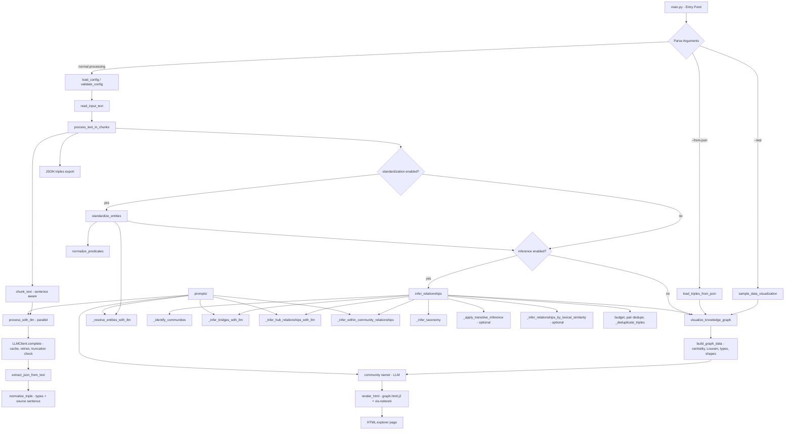

# AI Powered Knowledge Graph Generator

This system takes an unstructured text document, and uses an LLM of your choice to extract knowledge in the form of Subject-Predicate-Object (SPO) triplets, and visualizes the relationships as an interactive knowledge graph.
A demo of a knowlege graph created with this project can be found here: [Industrial-Revolution Knowledge Graph](https://robert-mcdermott.github.io/ai-knowledge-graph/)


## Features

- **Sentence-aware chunking**: large documents are split on sentence boundaries with overlap, and chunks are extracted in parallel
- **Typed knowledge extraction**: the LLM returns Subject-Predicate-Object triples with entity types (person, organization, place, event, technology, product, work, date, concept) and every extracted relationship keeps the sentence it came from
- **Entity standardization**: case, stop-word and plural variants are merged, with an optional LLM pass for the rest
- **Conservative, traceable inference**: LLM passes bridge isolated parts of the graph and add well-known relationships between central entities; a deterministic taxonomy rule links specific terms to general ones; every inferred edge carries its method and is capped relative to the extracted edges
- **Interactive explorer**: a single self-contained HTML file with search, click-to-highlight, a relationships panel with sources, named communities, entity-type filters, a shortest-path finder, exports and light/dark themes
- **Robust LLM client**: truncation detection for reasoning models, retries with back-off, automatic `max_completion_tokens` fallback, environment-variable API keys and an on-disk response cache
- **Works with any OpenAI-compatible endpoint**: Ollama, LM Studio, vLLM, OpenAI, Gemini, OpenRouter, LiteLLM (which fronts AWS Bedrock, Azure OpenAI, Anthropic and many others)

## Requirements

- Python 3.11+
- Dependencies: `networkx`, `jinja2`, `requests` (installed by `pip install -e .` or `uv sync`)

## Quick Start

1. Clone this repository
2. Install: `pip install -e .` (or `uv sync`)
3. Configure your settings in `config.toml`
4. Run the system:

```bash
generate-graph --input your_text_file.txt --output knowledge_graph.html
```

Or with UV:

```bash
uv run generate-graph --input your_text_file.txt --output knowledge_graph.html
```

Or straight from the checkout without installing:

```bash
python generate-graph.py --input your_text_file.txt --output knowledge_graph.html
```

### Development

```bash
pip install -e ".[dev]"   # adds pytest and ruff
pytest -q                 # 108 tests, no LLM needed
ruff check .
```

## Configuration

The system is configured with a TOML file (`config.toml` by default, or `--config other.toml`).
Every key except `model` and `base_url` is optional; the values shown are the defaults.

```toml
[llm]
model = "gemma3"                 # any model name your endpoint accepts
api_key = "sk-1234"              # or "env:OPENAI_API_KEY" to read it from the environment
base_url = "http://localhost:11434/v1/chat/completions"  # any OpenAI-compatible chat completions URL
max_tokens = 32768               # reasoning models need a large budget, see note below
temperature = 0.2                # omit for models that only accept the default (e.g. gpt-5)
#reasoning_effort = "low"        # passed through to servers/models that support it
#timeout = 300                   # seconds per request
#max_retries = 3                 # retries on 429/5xx/connection errors
#token_param = "auto"            # auto-switches to max_completion_tokens for newer OpenAI models
#json_mode = false               # request response_format = json_object
#concurrency = 4                 # chunks extracted in parallel
#cache_dir = ".kg-cache"         # cache LLM replies; re-running the same input is free ("" disables, or --no-cache)
#[llm.extra_body]                # arbitrary extra request fields, e.g. Ollama's think switch (keep last in [llm])
#think = false
#[llm.extra_headers]             # extra HTTP headers, e.g. OpenRouter attribution

[chunking]
chunk_size = 500                 # target words per chunk; chunks end on sentence boundaries
overlap = 50                     # words of trailing sentences repeated in the next chunk

[standardization]
enabled = true                   # merge case / stop-word / plural variants of the same entity
use_llm_for_entities = true      # extra LLM pass that groups remaining variants (one call)
#merge_word_subsets = false      # aggressive merging by shared words ("steam engine factories" -> "steam engine")

[inference]
enabled = true                   # master switch
use_llm_for_inference = true     # master switch for the LLM methods below
#llm_bridge = true               # link every isolated component to the main graph
#max_bridge_components = 20      # ...for up to this many components, batched
#bridge_groups_per_call = 5
#llm_hub = true                  # well-known relationships among the most central entities
#hub_entities = 25
#hub_max_new = 25
#taxonomy = true                 # rule: "quantum computing" is a "computing" (deterministic)
apply_transitive = false         # rule: A->B->C => A->C for transitive predicate families only
#transitive_predicate_groups = ["is a", "part of", "located in", "led to"]
#transitive_max_hub_degree = 10  # never chain through nodes with more connections than this
#transitive_max_per_subject = 5
#lexical = false                 # rule: "related to" edges for names sharing a word (noisy)
#lexical_min_word_length = 5
#max_inferred_ratio = 0.5        # cap inferred edges at this fraction of extracted edges

[visualization]
edge_smooth = false              # or "dynamic", "continuous", "curvedCW", ... (true = "continuous")
name_communities = true          # ask the LLM for a short name per community (one call)
show_inferred = true             # whether inferred (dashed) relationships are visible when the page opens
theme = "light"                  # initial theme: "light" or "dark"
edge_labels = "all"              # initial edge label mode: "all", "selection" or "none"
```

Rule-based inference (`apply_transitive`, `lexical`) is off by default because in testing it generated
roughly 70 % of all edges and hid the relationships actually found in the text. Local overrides such as
`config-*.toml` and `config.local.toml` are ignored by git.

### Provider examples

```toml
# OpenAI
[llm]
model = "gpt-4.1-mini"
api_key = "env:OPENAI_API_KEY"
base_url = "https://api.openai.com/v1/chat/completions"

# Google Gemini (OpenAI-compatible endpoint)
[llm]
model = "gemini-2.5-flash"
api_key = "env:GEMINI_API_KEY"
base_url = "https://generativelanguage.googleapis.com/v1beta/openai/chat/completions"

# LM Studio / vLLM / LiteLLM proxy (any OpenAI-compatible server)
[llm]
model = "your-model-name"
api_key = "not-needed"
base_url = "http://localhost:1234/v1/chat/completions"
```

### A note on reasoning models

Models such as DeepSeek, Qwen3, gpt-5 and the o-series "think" before they answer, and that
hidden reasoning is charged against `max_tokens`. With a small budget the model can spend
everything on reasoning and return **no answer at all**. The generator detects this
(`finish_reason = "length"`) and aborts with an explanation instead of silently producing an
empty graph. Set `max_tokens` to 16k–32k for such models, lower `reasoning_effort`, use
smaller chunks, or pass `--continue-on-error` to skip failed chunks and accept an
incomplete graph.

## Command Line Options

- `--input FILE`: Input text file to process
- `--output FILE`: Output HTML file for visualization (default: knowledge_graph.html)
- `--config FILE`: Path to config file (default: config.toml)
- `--debug`: Enable debug output with raw LLM responses
- `--no-standardize`: Disable entity standardization
- `--no-inference`: Disable relationship inference
- `--continue-on-error`: Skip chunks whose LLM call fails or is truncated instead of aborting
- `--from-json FILE`: Re-render the visualization from a previously saved `.json` triples file (no LLM calls)
- `--no-cache`: Bypass the LLM response cache for this run
- `--test`: Generate sample visualization using test data

### Usage message (--help)

```bash
generate-graph --help
usage: generate-graph [-h] [--test] [--config CONFIG] [--output OUTPUT]
                      [--input INPUT] [--from-json FILE] [--debug]
                      [--no-standardize] [--no-inference]
                      [--continue-on-error] [--no-cache]

Knowledge Graph Generator and Visualizer

options:
  -h, --help           show this help message and exit
  --test               Generate a test visualization with sample data
  --config CONFIG      Path to configuration file
  --output OUTPUT      Output HTML file path
  --input INPUT        Path to input text file (required unless --test or
                       --from-json is used)
  --from-json FILE     Render a visualization from a previously saved triples
                       JSON file (no LLM calls)
  --debug              Enable debug output (raw LLM responses and extracted
                       JSON)
  --no-standardize     Disable entity standardization
  --no-inference       Disable relationship inference
  --continue-on-error  Skip chunks whose LLM call fails or is truncated
                       instead of aborting
  --no-cache           Do not read or write the LLM response cache
                       (llm.cache_dir)
```

### Example Run

**Command:**

```bash
generate-graph --input data/industrial-revolution.txt --output industrial-revolution-kg.html
```
**Console Output** (gemma4 via Ollama, about 20 seconds):

```text
Using input text from file: data/industrial-revolution.txt
==================================================
PHASE 1: INITIAL TRIPLE EXTRACTION
==================================================
Processing text in 3 chunks (size: 500 words, overlap: 50 words)
Extracting with 3 parallel requests
Processing chunk 1/3 (490 words)
Processing chunk 2/3 (495 words)
Processing chunk 3/3 (76 words)
Chunk 1: 58 triples
Chunk 2: 79 triples
Chunk 3: 15 triples

Extracted a total of 152 triples from all chunks

==================================================
PHASE 2: ENTITY STANDARDIZATION
==================================================
Starting with 152 triples and 154 unique entities
Standardizing entity names across all triples...
Applied LLM-based entity standardization for 12 entity groups
Removed 7 self-referencing triples
Standardized 154 entities into 152 standard forms
After standardization: 145 triples and 133 unique entities

==================================================
PHASE 3: RELATIONSHIP INFERENCE
==================================================
Starting with 145 triples
Top 5 relationship types before inference:
  - enabled: 11 occurrences
  - used in: 8 occurrences
  - altered: 8 occurrences
  - invented: 7 occurrences
  - involved: 7 occurrences
Inferring additional relationships between entities...
Identified 11 disconnected components in the graph
LLM bridging proposed 11 relationships for 10 isolated components
LLM hub enrichment proposed 25 relationships among the 25 most central entities
Within-community LLM inference proposed 10 relationships
Taxonomy rule proposed 3 relationships
Transitive inference proposed 2 relationships (skipped 3 paths through hub nodes)
Accepted 48 inferred relationships (llm_bridge: 11, llm_hub: 23, llm_within: 10, taxonomy: 2, transitive: 2); dropped 3 already-connected pairs

Top 5 relationship types after inference:
  - enabled: 18 occurrences
  - is a: 15 occurrences
  - used in: 8 occurrences
  - altered: 8 occurrences
  - invented: 7 occurrences

Added 48 inferred relationships
Final knowledge graph: 189 triples
Saved raw knowledge graph data to industrial-revolution-kg.json
Processing 189 triples for visualization
Found 133 unique nodes
Found 48 inferred relationships
Detected 13 communities using Louvain method
Named 13 communities
Knowledge graph visualization saved to industrial-revolution-kg.html

Knowledge Graph Statistics:
Nodes: 133
Edges: 189
Communities: 13

To view the visualization, open the following file in your browser:
file:///path/to/industrial-revolution-kg.html
```

## Output files

Next to the HTML page the generator writes a JSON file with the same base name containing every triple:

```json
{
  "subject": "james watt",
  "predicate": "refined",
  "object": "steam engine",
  "subject_type": "person",
  "object_type": "technology",
  "source": "A key catalyst of the First Industrial Revolution was the refinement of the steam engine by Scottish engineer James Watt, ...",
  "chunk": 1
}
```

Inferred triples carry `"inferred": true` and a `"method"` (`llm_bridge`, `llm_hub`, `llm_within`,
`taxonomy`, `transitive` or `lexical`); transitive triples also record the intermediate node in `"via"`.
The JSON can be re-rendered at any time with `generate-graph --from-json graph.json --output graph.html`
(or `python json_to_html.py graph.json graph.html`), and the page itself can export the visible triples as
JSON or CSV.

## How It Works

1. **Chunking**: The document is split into overlapping chunks on sentence boundaries to fit within the LLM's context window
2. **First Pass - SPO Extraction**: 
   - Chunks are processed by the LLM in parallel (`llm.concurrency`) to extract typed Subject-Predicate-Object triplets, each tagged with the sentence it came from
   - Implemented in the `process_with_llm` function
   - The LLM identifies entities and their relationships within each text segment
   - Results are collected across all chunks to form the initial knowledge graph
3. **Second Pass - Entity Standardization**:
   - Variants that differ only by case, stop-words or plural form are merged ("The Steam Engines" / "steam engine")
   - Optional LLM-assisted entity alignment (`standardization.use_llm_for_entities`, one call): the LLM reviews the most frequent entities and groups the ones that refer to the same concept (e.g., "AI", "artificial intelligence", "AI system")
   - Predicate tense variants are normalized ("involve" / "involves"), and self-referencing triples are dropped
4. **Third Pass - Relationship Inference** (`inference.enabled`):
   - LLM *bridging* links every isolated component of the graph to the main component, in batched calls
   - LLM *hub enrichment* adds well-known relationships between the most central entities (e.g. "internet enabled e-commerce")
   - LLM *within-component* inference connects lexically related but unconnected pairs
   - A deterministic *taxonomy* rule links specific terms to their general term ("quantum computing" is a "computing")
   - Optional rules (off by default): transitive chains through transitive predicate families, and lexical similarity
   - Candidates are accepted in that priority order; a node pair is never connected twice, and the total is capped at `max_inferred_ratio` × the number of extracted triples. Every inferred triple records its method.
5. **Visualization**: centrality metrics and Louvain communities are computed with NetworkX, the LLM names the communities (one call), and the interactive page is rendered from the project's own template with the vis-network library embedded

The second and third passes and community naming are optional and can be disabled in the configuration to minimize LLM usage. LLM replies are cached on disk, so re-running the same document with the same settings makes no API calls.

## Visualization Features

The generated HTML is a single self-contained file (vis-network is embedded) that works offline.

- **Explore by clicking**: click a node to highlight its neighbourhood and open a details panel listing every
  incoming and outgoing relationship, tagged *extracted* or with its inference method; click a row to jump to
  that node. Double-click to zoom in.
- **Entity types**: the extraction pass labels every entity (person, organization, place, event, technology,
  product, work, date, concept); node shapes reflect the type and the Communities panel can filter by it.
- **Provenance**: each extracted relationship carries the sentence it came from, shown in tooltips and in
  the details panel, so inferred edges are easy to tell apart from what the text actually says.
- **Named communities**: after community detection the LLM gives each community a short name (one call;
  disable with `visualization.name_communities = false`).
- **Path finder**: from any selected node, type another node's name to highlight the shortest chain of
  relationships between them, optionally through extracted relationships only.
- **Search** with autocomplete (`/`), and shareable links: the selected node is kept in the URL (`#node=...`).
- **Communities panel**: colour-coded Louvain communities with their top entities, toggle any of them on/off,
  a minimum-connections slider, and a switch for inferred relationships.
- **Edge labels**: shown for all edges by default (`visualization.edge_labels`); cycle to *none* or *selection only*, which keeps dense graphs readable. Around a selected node only its own edges are labelled.
- **Node size** reflects importance (degree, betweenness and eigenvector centrality).
- **Extracted vs inferred**: solid lines are extracted from the text, dashed lines are inferred; tooltips show
  the inference method and, for transitive edges, the intermediate node.
- **Export** the current view as PNG, or the visible triples as JSON or CSV.
- **Physics controls**, a layout progress bar, automatic physics freeze for graphs over 300 nodes, light and
  dark themes (`visualization.theme`), keyboard shortcuts (`?` for the list), responsive layout.

## Project Layout

```
.
├── config.toml                     # Main configuration file for the system
├── generate-graph.py               # Run from a checkout without installing
├── json_to_html.py                 # Re-render a saved .json graph (same as --from-json)
├── pyproject.toml                  # Project metadata, dependencies, tool config
├── requirements.txt                # Pinned dependencies for 'pip' users
├── uv.lock                         # Lock file for 'uv' users
├── IMPROVEMENT_PLAN.md             # Roadmap / task list
├── .github/workflows/ci.yml        # Lint + tests on Python 3.11-3.13
├── data/                           # Sample input text and screenshot
├── docs/                           # GitHub Pages demo
├── tests/                          # pytest suite (runs without an LLM)
└── src/knowledge_graph/            # Core package (installed as `knowledge_graph`)
    ├── __init__.py                 # Package initialization and version
    ├── config.py                   # Configuration loading, defaults and validation
    ├── entity_standardization.py   # Entity standardization and relationship inference
    ├── llm.py                      # LLM client (retries, truncation detection, cache) and JSON extraction
    ├── main.py                     # CLI, input handling and pipeline orchestration
    ├── text_utils.py               # Sentence splitting, chunking and provenance lookup
    ├── visualization.py            # Graph metrics, communities and page rendering
    ├── prompts/                    # LLM prompts (extraction, entity resolution, inference, community naming)
    └── templates/
        ├── graph.html.j2           # The interactive explorer page (Jinja2)
        └── vendor/                 # Embedded vis-network library
```

## Program Flow

This diagram illustrates the program flow.



## Program Flow Description

1. **Entry Point**: `main.py` parses the command line and loads and validates the configuration (`config.py`), applying defaults and resolving `env:` API keys.

2. **Mode Selection**:
   - `--test` renders the built-in sample graph
   - `--from-json` re-renders a previously saved triples file without any LLM calls
   - Otherwise the input text file is read (UTF-8 with fallbacks; binary formats are rejected with a hint)

3. **Extraction**: `text_utils.py` splits the text into sentence-aligned chunks; chunks are sent to the LLM in parallel through `LLMClient` (`llm.py`), which caches replies, retries transient failures and aborts on truncated answers. Replies are parsed with `extract_json_from_text`, typed, and tagged with their source sentence.

4. **Entity Standardization** (optional): merges entity variants, optionally with an LLM pass, and normalizes predicates.

5. **Relationship Inference** (optional): LLM bridging, hub enrichment and within-component passes plus the taxonomy rule (and optional transitive/lexical rules), with priority ordering, pair de-duplication and a budget.

6. **Visualization**: `visualization.py` computes centrality and Louvain communities, asks the LLM to name the communities, and renders the explorer page from `templates/graph.html.j2` with vis-network embedded.

7. **Output**: the HTML page and the JSON triples file, plus a statistics summary on the console.

## Troubleshooting

- **"Response ... was cut off (finish_reason='length')"**: the model spent the token budget on hidden reasoning. Raise `max_tokens` to 32k, set `reasoning_effort = "low"`, use smaller chunks, or switch to a non-reasoning model. `--continue-on-error` skips the failed chunk instead of aborting.
- **gpt-5 / o-series reject `max_tokens` or `temperature`**: the client switches to `max_completion_tokens` automatically; remove the `temperature` line for models that only accept the default.
- **"'utf-8' codec can't decode"**: the input is not plain text. Convert PDFs first (`pdftotext file.pdf file.txt`); other encodings are detected automatically.
- **Identical re-runs still call the API**: the cache key includes the model and every request parameter, so any config change is a miss. Delete `.kg-cache/` to start fresh.
- **Graph looks fragmented**: check that `inference.enabled` and `use_llm_for_inference` are on; small models sometimes name the same concept differently across chunks, and a lower `temperature` helps.
