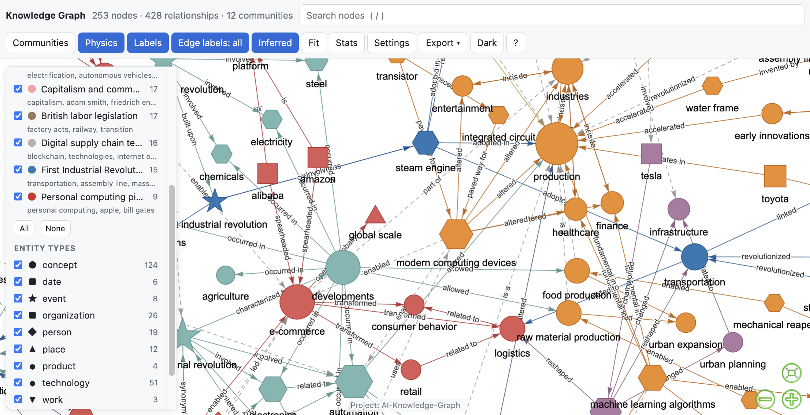

# AI Knowledge Graph

Turn documents into a knowledge map you can explore, question, correct, and grow. Use your choice of LLM, keep your collections in local files, and share interactive stories as portable HTML.

[Explore the live examples](https://robert-mcdermott.github.io/ai-knowledge-graph/) · [Workspace guide](docs/WORKSPACES.md) · [Configuration](docs/CONFIGURATION.md) · [Contributing](CONTRIBUTING.md)



## What's new

- **Inspect the evidence.** Relationships carry exact source passages, document names, character offsets, and PDF page numbers. Claims repeated across documents retain all supporting passages.
- **Build a lasting collection.** Add, update, or remove documents without re-extracting unchanged files. Preview document changes before generation and inspect claim changes before applying a browser update.
- **Correct your graph.** Reject and restore claims, merge entity names, and undo merges. Corrections and saved views live alongside the original claims.
- **Follow a story.** Start with community discovery cards, focus on a neighborhood, expand outward, trace a path, and save annotated views. Export a sequence of views as an offline interactive story.
- **Ask better questions.** Chat retrieves Unicode names, aliases, and source-passage terms. Overview questions draw facts from across communities. Inline citations open evidence; an extracted-only option excludes inferred facts from retrieved context.
- **Choose the task.** General reading, research literature, and organizations profiles guide extraction. Relationships preserve negation, time, attribution, and full predicate text when supplied by the model.
- **See what is happening.** Check the model connection, try a short extraction, inspect progress and extraction usage, cancel work, and retry partial runs.

The lightweight core still exports JSON, CSV, GraphML, Cypher, and self-contained HTML. It needs no database or vector service. New generation and chat use an OpenAI-compatible chat completions endpoint; exploring existing graphs does not require one.

## Quick start

Python 3.11 or later is required.

```bash
git clone https://github.com/robert-mcdermott/ai-knowledge-graph.git
cd ai-knowledge-graph
uv sync --extra web
# Alternative: pip install -e ".[web]"
```

Try the included graphs without calling a model:

```bash
uv run graph-serve --graphs data/samples --open
```

Or render an example as an offline file:

```bash
uv run generate-graph --from-json data/samples/marie-curie.json --output out/marie-curie.html
```

To use your own documents, set `[llm].model` and `[llm].base_url` in `config.toml`, or create a separate configuration file. For a local endpoint, for example:

```toml
[llm]
model = "your-installed-model"
base_url = "http://localhost:11434/v1/chat/completions"
```

For an endpoint requiring credentials, use `api_key = "env:LLM_API_KEY"` and set that environment variable. See the [configuration reference](docs/CONFIGURATION.md) for all settings.

```bash
uv run generate-graph --check
uv run graph-serve --graphs out --open
```

In the browser, paste text or upload documents, choose an extraction profile, and select **Preview changes**. **Try a short extraction** tests the first 2,000 characters of pasted text. The preview of document changes makes no model calls; connection checks, trial extraction, generation, and chat use your configured endpoint.

For PDF and DOCX input, install their extras with `uv sync --extra all` or `pip install -e ".[all]"`. Scanned PDFs need OCR before import.

## Grow a collection from the command line

```bash
# Create a collection, retaining its sources and corrections
uv run generate-graph --collection out/research.json --input papers/ --profile research

# Preview an addition or revision without extraction or writes
uv run generate-graph --collection out/research.json --input new-paper.txt --preview-update

# Apply the change; unchanged documents are skipped
uv run generate-graph --collection out/research.json --input new-paper.txt

# Remove one document and only its evidence
uv run generate-graph --collection out/research.json --remove-document new-paper.txt

# Ask a question using extracted facts
uv run graph-chat out/research.json "What are the main themes?" --extracted-only
```

A document's name identifies it within a collection. Reusing the name replaces that document; use distinct names for distinct sources. The browser stages updates for review; the CLI applies them directly. See the [workspace guide](docs/WORKSPACES.md) for retries, source identity, corrections, and backups.

The original single-run workflow is also available:

```bash
uv run generate-graph --input data/industrial-revolution.txt --output out/industrial.html
uv run generate-graph --input notes.txt --output out/notes.html --no-inference --strict-evidence
uv run generate-graph --from-json out/notes.json --output out/notes.html --export csv,graphml,cypher
uv run graph-chat out/notes.json "What connections does this document describe?"
```

Use `generate-graph --help`, `graph-chat --help`, and `graph-serve --help` for every option. `--preview` limits ordinary generation to the first 2,000 characters of the first document; choose a separate output name for that trial.

## Explore, review, and share

1. Pick a theme in **Explore**, or search for an entity with `/`.
2. Select **Focus nearby**, then **Expand** to grow the visible neighborhood. **Full map** clears the neighborhood restriction; other filters still apply.
3. Open a **source passage** to inspect a claim. Source-linked means the cited passage exists, not that the claim has been independently verified. Legacy source text is explicitly marked unverified.
4. Use **Review** in the local app to reject/restore claims or merge/unmerge names.
5. Save a title and note in **Stories**. Saved views retain selection, filters, path, and camera position. **Play story** walks through the views; **Export HTML** packages them for offline viewing.

**Share view** copies a link with the current view in its URL. Recipients need access to the same graph URL; a localhost link only works on your machine. For a portable result, export the HTML story instead.

**Sources** filters by document. **Communities** filters by community, entity type, relationship, and minimum connections. **Display** contains physics, labels, inferred-edge visibility, fitting, and statistics. **Export** writes visible triples as JSON/CSV or an image as PNG. Dark mode is remembered in the browser.

Static pages can save views in browser storage and export stories. Persistent claim corrections, collection changes, and model-backed chat require `graph-serve`.

## Understand the evidence

Extraction first gives the model labeled passages and then checks its returned source IDs against those passages. It never guesses a citation by matching entity names. With `--strict-evidence`, any claim lacking a valid source reference fails its chunk, allowing an explicit retry. Without it, such claims are retained as **unverified**.

Source references do not establish entailment: a model can still link a real passage to an incorrect claim. Review the passage before relying on a relationship. Inferred edges are dashed and record their method; a path through a graph is a connection, not proof of causation. Chat citation validation resolves fact numbers but does not independently verify the answer.

Full relationship text and qualifiers remain in JSON and exports. Claim identity includes polarity, time, and attribution, so differently qualified claims are not silently collapsed. Duplicate evidence references are deduplicated; multiple documents are not automatically treated as independent corroboration.

## Files and compatibility

| File | Contents |
|---|---|
| `name.json` | Compatible flat list of the currently active triples |
| `name.workspace.json` | Versioned sources, original claims, corrections, saved views, and recent run summaries |
| `name.html` | Portable explorer, including evidence and saved views |
| `name.meta.json` | Stored community names and generation metadata |
| `name.csv`, `.graphml`, `.cypher` | Optional exports |

Keep the workspace sidecar with its JSON file. It is authoritative when present; edit through the app instead of modifying only the flat export. Older triples files still open without a migration. Their old source snippets remain unverified until regenerated from the original documents.

The local server defaults to `out/` and binds to `127.0.0.1:8008`. It has no accounts or authentication and is intended for personal local use. Generation sends source text to your configured model endpoint. Workspace files retain the extracted text; back up or share them accordingly. One generation or pending update runs at a time.

## Examples and development

The five committed examples cover the Industrial Revolutions, Marie Curie, the Apollo Program, a coffee supply chain, and the Alhambra in Spanish. They exercise legacy imports and can be explored offline. Chat and regenerating the examples require your model.

```bash
uv sync --extra dev --extra all
uv run ruff check src tests
uv run pytest -q
uv run python scripts/build_docs.py
```

The last command rebuilds the GitHub Pages gallery from existing sample JSON without model calls. Shared-library gallery pages export a self-contained story by embedding their loaded assets; when opened directly from disk, re-render with `--from-json` without `--library-path` if the browser blocks fetching those local assets.

See [CONTRIBUTING.md](CONTRIBUTING.md) for architecture and validation, [CHANGELOG.md](CHANGELOG.md) for this release, and the [review roadmap](REVIEW_RECOMMENDATIONS.md) for follow-on ideas.

## Troubleshooting

- **Connection check fails:** verify the endpoint URL, model name, credentials, and that a local model server is running. The check bypasses the reply cache.
- **Empty, truncated, or invalid extraction:** inspect the reported chunk error. Increase the response budget or reduce chunk size. `--continue-on-error` publishes explicit partial results; the browser offers a retry.
- **A partial collection:** retry through its job page, or resubmit the affected documents using `--collection`. Cached successful requests can be reused; failed or malformed extraction replies are not retained as successful cache entries.
- **An update conflicts:** the collection changed after extraction. Discard the pending update and create a fresh preview. This preserves newer corrections and views.
- **Missing links in a filtered graph:** clear the source, relationship, community, type, and neighborhood filters. Turn on inferred edges only if you want model- or rule-proposed connections too.
